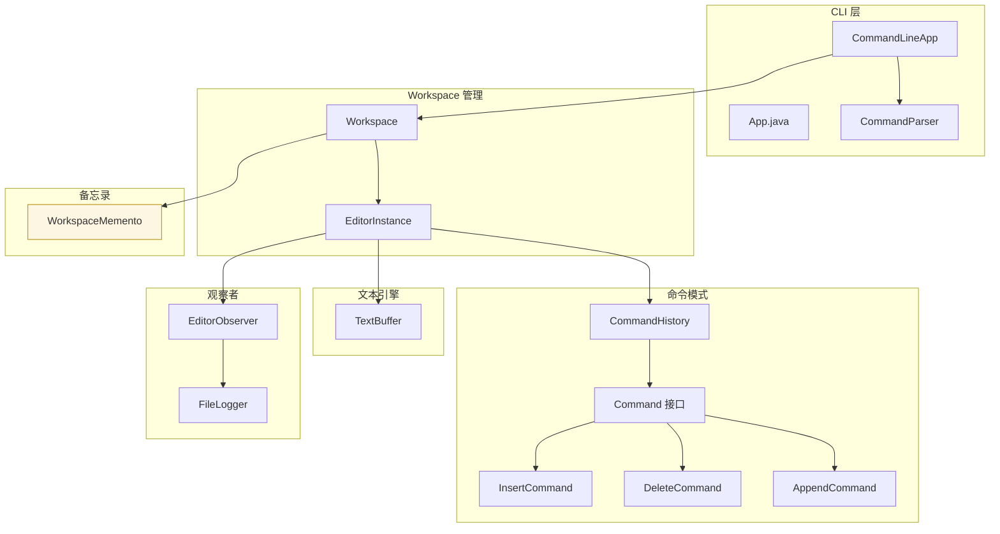

# README: Lab 1 Text Editor

## 1. 系统架构

### 1.1. 模块划分图（逻辑视图）



> 说明：CLI 调用 Workspace；Workspace 聚合多个 EditorInstance；EditorInstance 组合 TextBuffer 与 CommandHistory，并通过观察者向 FileLogger 发出事件；备忘录保存 Workspace 状态（文件列表 + 活动文件 + 日志与修改标记）。

### 1.2. 模块职责说明

| 模块       | 职责                                                           | 关键类                                                                              | 备注                         |
| ---------- | -------------------------------------------------------------- | ----------------------------------------------------------------------------------- | ---------------------------- |
| CLI 交互层 | 解析用户输入、分派命令、交互提示（保存确认/冲突选择）          | `CommandLineApp`, `CommandParser`                                                   | 提供用户体验与参数校验       |
| 工作区管理 | 管理多文件生命周期、活动文件、保存、日志开关、状态持久化       | `Workspace`, `EditorInstance`                                                       | 封装文件级操作入口           |
| 文本引擎   | 按行存储与操作文本（追加/插入/删除），提供非跨行的原子编辑能力 | `TextBuffer`                                                                        | 删除空行特例、零长度安全处理 |
| 命令模式层 | 封装可撤销操作（插入/删除/追加），维护历史栈支持 undo/redo     | `Command` 接口, `InsertCommand`, `DeleteCommand`, `AppendCommand`, `CommandHistory` | 追加操作新纳入命令统一管理   |
| 观察者层   | 监听命令执行/撤销/重做并写日志（可选启用）                     | `EditorObserver`, `FileLogger`                                                      | 日志文件命名 `.filename.log` |
| 备忘录层   | 持久化并恢复工作区（打开文件、活动文件、修改状态、日志开关）   | `WorkspaceMemento`                                                                  | 简单文本序列化格式           |

### 1.3. 模块依赖关系

- CLI 层依赖：Workspace（业务入口）、具体命令类（构造并 push）、解析器（分词+引号处理）。
- Workspace 依赖：EditorInstance、WorkspaceMemento、FileLogger。
- EditorInstance 聚合：TextBuffer、CommandHistory、Observers。
- CommandHistory 依赖 Command 接口多态执行；通过回调触发 EditorInstance 通知。
- FileLogger 依赖 Observer 接口；仅在启用日志后被注册。
- WorkspaceMemento 独立：序列化 POJO 数据结构（文件路径 + 状态）。

依赖方向严格自上而下；下层（TextBuffer，命令类）不感知上层；可扩展新命令无需改动 Workspace/CLI 之外逻辑（仅在 CLI 分派加 case）。

## 2. 核心设计

### 2.1. 设计模式应用说明

| 模式     | 应用位置                        | 目的                     | 价值                            |
| -------- | ------------------------------- | ------------------------ | ------------------------------- |
| Command  | Insert/Delete/Append 操作       | 封装可撤销动作           | 支持统一的 undo/redo 与日志扩展 |
| Observer | FileLogger 监听命令事件         | 低耦合记录执行/撤销/重做 | 不污染命令具体逻辑，按需启用    |
| Memento  | WorkspaceMemento 保存工作区状态 | 程序重启恢复上下文       | 简化用户连贯编辑体验            |

### 2.2. 关键设计要点与权衡

1. 行级模型：`TextBuffer` 仅处理单行编辑，避免复杂跨行切片；多行插入通过拆分与行插入实现。删除不支持跨行，降低实现难度。空行整行删除作为特例。
2. Undo/Redo 简化：`InsertCommand` 对多行插入撤销仍保留 TODO（当前仅删除第一行插入内容），后续可引入复合命令或捕获结构快照。  
3. Append 纳入命令：通过新增 `AppendCommand` + `removeLastLines` API，实现与其他操作一致的撤销与日志；多行追加使用 `split("\n")` 保留末尾空行。  
4. 日志开关策略：文件首行 `#log` 或显式 `log-on` 激活，保证加载后可自动启用；日志文件名统一前缀 `.` 符合常见隐藏文件约定。  
5. 工作区状态：仅保存文件路径与标记，不保存内容；内容由磁盘真实文件来源 —— 新建未保存缓冲区在恢复时仍为空（与真实文件一致）。  
6. 路径与多文件匹配：`findFilesByName` 支持大小写不敏感匹配，为 CLI 模糊选择提供交互；保留冲突时用户选择。  
7. 新文件修改标记：`init`/`initWithLog` 默认标记已修改以便退出前提示保存，减少“误以为已持久化”的风险。  

### 2.3. 可扩展点

- 复合命令：处理多行插入/批量脚本原子化撤销。
- 跨行删除：引入区间模型 (range) 及行合并策略。
- 日志分级：INFO/DEBUG/ERROR 分类与最大文件大小轮转。
- 多用户协同：抽象 EditorInstance 为会话，增加锁与变更合并。

## 3. 运行说明

### 3.1. 环境与语言版本

- JDK: 23 (`<maven.compiler.release>23</maven.compiler.release>`)  
- 构建工具: Apache Maven  
- 测试框架: JUnit 4.11  

### 3.2. 安装与构建步骤

```bash
#（确保已安装 JDK23 与 Maven）
mvn clean package
```

生成 `target/editor-1.0-SNAPSHOT.jar`。

### 3.3. 运行程序

```bash
java -jar target/editor-1.0-SNAPSHOT.jar
```

启动后使用交互命令（见 `USAGE.md`）：
示例：

```text
> init demo.txt with-log
> append "Hello"
> insert 1:6 " World"
> delete 1:1 5
> undo
> redo
> save
> exit
```

### 3.4. 运行测试

```bash
mvn test
```

## 4. 2.4 测试文档

### 4.1. 测试用例类别与覆盖

| 类别        | 测试类                   | 关注点                                 | 代表性用例                                                                     |
| ----------- | ------------------------ | -------------------------------------- | ------------------------------------------------------------------------------ |
| 文本缓冲    | `TextBufferTest`         | append/insert/delete/边界/空行/零长度  | `testDeletePositiveLengthOnEmptyLineRemovesLine`、`testInsertMultipleNewlines` |
| 命令模式    | `CommandTest` (假定存在) | 历史栈 push/undo/redo 顺序与栈大小变化 | 撤销后 redo 恢复内容                                                           |
| 工作区管理  | `WorkspaceTest`          | 多文件切换/保存/未保存检测/日志初始化  | `testHasUnsavedChanges_multipleFilesAfterPartialSave`                          |
| Phase4 功能 | `Phase4Test` (假定存在)  | 扩展功能（如显示范围、列表输出）       | 显示行范围正确标号                                                             |
| 追加命令    | `AppendCommandTest`      | 单行/多行追加、undo/redo、日志写入     | `testMultiLineAppendUndoRedo`, `testAppendLogging`                             |

### 4.2. 测试用例列表（摘要）

- TextBuffer：行追加、行内插入（头/中/尾）、多行插入拆分、空行删除特例、零长度删除 no-op、边界异常抛出、复杂操作组合。
- Workspace：文件 init/load/activate/close、保存与修改标志、状态与未保存文件集合、文件名大小写不敏感匹配、日志自动启用、独立历史验证。
- AppendCommand：追加单行、多行、撤销/重做一致性、日志文件包含执行/撤销/重做记录。

### 4.3. 测试执行结果

```text
所有测试通过：
- TextBufferTest：全部通过
- WorkspaceTest：全部通过
- AppendCommandTest：全部通过
- 其他（Command/Phase4）历史通过（未修改部分保持稳定）
```
